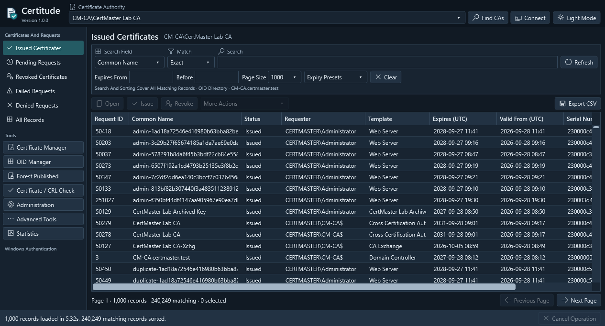

#  Certitude

A compact x64 WPF application for Windows Certificate Services administration. Uses your Windows identity and existing CA permissions, targets **.NET Framework 4.7.2**, and has no NuGet or third-party runtime dependencies.

Licensed under the [GNU General Public License v3.0](LICENSE.md).



## Build and run

Build with Visual Studio 2026 or equivalent MSBuild, a **C# 14** compiler, the .NET desktop workload and the **.NET Framework 4.7.2 targeting pack**:

```powershell
msbuild Code\Certitude.sln /m /p:Configuration=Release /p:Platform=x64
.\Code\bin\Release\Certitude.exe
```

Run on Windows with Desktop Experience, .NET Framework 4.7.2+ and AD CS management tools. Deploy `Certitude.exe` and `Certitude.exe.config` together from `Code\bin\Release`. Running on 4.8+ also enables its newer WPF accessibility, DPI and cryptography behavior.

[Build/Build.cmd](Build/Build.cmd) creates a signed portable ZIP in `Binaries`. It requires PowerShell 5.1+, Windows SDK SignTool, a code-signing certificate and timestamp-service access. It deletes prior staging contents and the same-version ZIP before rebuilding.

### Connect to a CA

Select a discovered CA and **Connect**, refresh discovery with **Find CAs**, or enter `SERVER\CA name`. The local CA is detected automatically; directory failures do not prevent manual connections. Remote access requires AD CS client components, permissions and working DCOM/RPC. Service control and maintenance may require elevation.

**All CAs** combines listed authorities, including successful remembered manual connections. Searches, sorting, paging and export span them; record actions use each row's CA, since request IDs are not globally unique. Unreachable CAs are skipped with a persistent notice and error tooltip; reconnect to retry them or update the authority list. If none are reachable, the query fails. **Administration**, **Advanced Tools** and **Statistics** require a single CA; enrollment requires an explicit target.

### Saved workspace and views

`%LOCALAPPDATA%\Certitude\workspace.xml` stores remembered CAs and the last successfully applied filters, sort and column layout. Startup restores the saved target, falling back to the local CA when none is saved. CA names and searches are plain text; certificate rows, credentials and keys are not stored. Failed manual connections and invalid/cancelled filter edits are not retained.

**Save current view** captures the CA, filters, page size, sort and columns as a named snapshot, pinned by default. Open it from **Saved View** or the sidebar to query from page one. **Manage saved views and connections** and pinned-view context menus support renaming, pinning and deletion; the manager also forgets connections. Replacing a view requires confirmation. Limits: 200 views, 80-character case-insensitively unique names. All CAs views use the current authority list; discovery may restore forgotten connections.

Saved expiry presets roll forward on open/refresh; typed dates remain fixed. Editing dates or changing category clears the preset. Named views change only when saved again.

Right-click a column header or choose **Columns** on a row menu to show/hide columns; drag to resize/reorder. At least one stays visible. **Reset Column Layout** restores defaults, including automatic CA-column visibility for All CAs. Explicit visibility choices override that default; CSV fields are unaffected.

Saves are atomic. Invalid settings remain untouched with a warning; close Certitude and move the file aside to reset. A stale application instance cannot overwrite newer settings; restart it to reload.

### Native Windows consoles

**Native CA MMC** and **Native Templates MMC**, below **Statistics**, launch the installed Windows consoles under your identity. They need AD CS management tools, not a Certitude connection, and manage their targets independently. Certitude neither elevates nor installs components for them.

## OID Manager

**OID Manager** searches forest OID registrations and shows template references, AD group links, localized names and policy statements. Leave the domain/controller blank for the current domain, or enter a DNS name and **Load Directory**. The displayed controller is independent of the selected CA; AD permissions apply.

**Add OID** registers an assigned application/issuance policy OID, rejecting invalid syntax and forest duplicates. It does not allocate an OID arc or edit templates. **Remove OID** confirms the target and rechecks references, blocking template/forest OIDs, protected objects and policies referenced by templates or AD groups. External use and unreplicated changes cannot be detected; issued certificates are unchanged. See [AD policy types](https://techcommunity.microsoft.com/blog/askds/the-certificate-template-manager-hangs-indefinitely/396078).

## Published certificates

**Forest Published** manages NTAuth, trusted root CA, AIA/intermediate, cross-certificate, KRA and Enrollment Services certificates. Load the current domain or a specified DNS domain/controller independently of the CA selector. Search certificates, inspect their AD location, export DER/PEM or open the Windows viewer. Expired and unreadable values remain visible. User/computer publications and CRLs are excluded.

**Add Certificate** previews one public certificate and confirms its target and trust purpose. CA stores require CA basic constraints; KRA requires its EKU. Duplicates are rejected. Enrollment Services accepts existing objects only and does not configure CAs/templates. Cross-certificates are added as forward pairs.

**Remove** rechecks the object and original value, preserving other certificates, the opposite pair member, objects and service settings. AD permissions and replication apply. Removal does not revoke certificates or clear client caches. See the [directory specification](https://learn.microsoft.com/en-us/openspecs/windows_protocols/ms-wcce/ad150321-4b89-4802-8713-6c7a51cc0b84) and [publication commands](https://learn.microsoft.com/en-us/windows-server/administration/windows-commands/certutil#-dspublish).

## Certificate browser

Views cover issued, pending, revoked, failed, denied and all records. **Dark Mode / Light Mode** is saved in `%LOCALAPPDATA%\Certitude\theme.txt`.

### Navigation and record actions

**Back / Escape** returns through inline pages with inputs preserved; leaving a confirmation cancels it. Active operations must finish or cancel first. File selection supports local/UNC paths and shows up to 5,000 entries; full paths select other files.

Row menus and **More Actions** expose applicable details, export, validation, issue/resubmit, deny, revoke, release-hold and attribute/extension actions. Issued records support encrypted archived-key retrieval. Bulk changes confirm CA/IDs and report individual outcomes. Only certificate hold can be reversed; publish CRLs separately after revocation changes.

**Delete From Database is permanent**, including attributes, extensions and archived keys. It neither revokes certificates nor removes store copies; deleting revoked records can remove them from future CRLs. Filtering alone deletes nothing. Operation results are transient, not a retained audit history.

Right-click preserves an existing bulk selection or selects the clicked row; empty space clears it. Shortcuts: **Ctrl+F** search, **F5** refresh, **Enter** apply search/open record, **Delete** review deletion, **Ctrl+A** select the loaded page, **Escape** back/cancel. Native certificate viewing is available wherever certificate data exists.

### Search, sorting and export

- Search is case-insensitive, defaults to **All Fields / Contains**, and spans all matching pages. **Exact** on one field and expiry bounds are fastest for large CAs; contains/prefix searches may scan every candidate.
- Changes apply after 400 ms, reset to page one and cancel superseded queries. Refresh applies immediately. Pages contain 500-10,000 records (default 1,000).
- Expiry dates accept `yyyy-MM-dd`, with UTC inclusive-start/exclusive-end bounds. Presets select expired or upcoming 7/30/60/90-day issued certificates.
- Column sorting spans all matching records, using numeric IDs, chronological dates and case-insensitive text. Ties use descending request ID, then CA name. Blanks sort first ascending, last descending.
- Newest-first retains one page; other sorts cache all matching metadata. Certificate bodies load on demand. **Export CSV** streams all matches with bounded memory and preserves existing output on failure/cancellation. CSV cells are quoted and formula-like text is protected.

Template searches match display/internal names and OIDs; sorting uses display names. Statistics combine aliases of the same template, not distinct templates with matching labels. Cached names come from the CA's forest and Windows, with numeric fallbacks and visible lookup errors. Refresh reloads names; other operations reuse them for up to five minutes, retrying failures after 30 seconds. Policy categories remain distinct. Offline checks avoid directory lookups; the native viewer uses Windows' resolver.

Queries are live, not transactionally consistent snapshots. Cancellation waits for active native calls and never reverses completed changes.

### Statistics

**Statistics** aggregates the entire CA independently of browser filters: dispositions, validity/expiry, revocations, top 100 template/requester groups, submissions, latency and certificate lifetimes. Counts include imported records, not deleted history, and do not establish deployment or trust.

CA/Server/Storage tabs add configuration, signing certificates, CRL publication, OS/process metrics and storage use through native APIs and read-only WMI. Remote access requires permissions/firewall access; unavailable metrics do not block counts. Folder scans are top-level, count shared folders once and report logical sizes, not reclaimable space. Refresh recollects; leaving requests cancellation.

## Command-line CSV export

Export CA records without opening WPF, using your Windows identity:

```powershell
.\Certitude.exe export --ca 'SERVER\CA Name' --output 'C:\Reports\expiring.csv' `
    --fields 'RequestID,CommonName,CertificateTemplate,NotAfter,Status' `
    --where 'Disposition=Issued' --where 'NotAfter>=today' --where 'NotAfter<today+30d' | Out-Host
$LASTEXITCODE
```

`--ca` defaults to the local CA. Without conditions, all dispositions are eligible. Repeated `--where` conditions use AND, not SQL or expression evaluation. Quote conditions and arguments containing spaces. PowerShell's `Out-Host` waits for this GUI executable; Command Prompt requires `start "" /wait Certitude.exe export ...`. Task Scheduler can invoke it directly.

`--fields` preserves column order; omit it for the eight standard browser fields or use `'*'` for all. Names, aliases and text comparisons ignore case. Discover syntax and fields offline:

```powershell
.\Certitude.exe export --help | Out-Host
.\Certitude.exe export --list-fields | Out-Host
```

| Field | Type / Meaning |
| --- | --- |
| `RequestID` | Integer ID |
| `CommonName` | Common name |
| `RequesterName` | Requester; alias `Requester` |
| `CertificateTemplate` | Raw internal name/OID; alias `Template` |
| `TemplateDisplayName` | Resolved display name, falling back to the raw identifier |
| `TemplateName` | Internal name; blank for unresolved numeric OIDs |
| `TemplateOid` | Resolved OID, if available |
| `SerialNumber` | Serial number as text |
| `NotBefore`, `NotAfter` | UTC validity dates; absent without a certificate |
| `Status` | Display status, including `Expired` |
| `Disposition` | Integer CA disposition; alias `Request.Disposition` |
| `RevocationReason` | Optional integer reason; alias `Request.RevokedReason` |
| `Configuration` | Source `SERVER\CA name` |

Template conditions use the selected field's raw or resolved semantics, e.g. `--where 'TemplateDisplayName=Web Server'`. Conditions may reference fields omitted from output; arbitrary CA columns and decoded extensions are not supported.

| Condition Type | Supported Operators | Example |
| --- | --- | --- |
| Text | `=`, `!=`, `contains`, `startswith`, `endswith` | `CommonName endswith .example.com` |
| Integer / Date | `=`, `!=`, `>`, `>=`, `<`, `<=` | `RequestID>=10000` |
| Blank / Missing | `is null`, `is not null` | `NotAfter is null` |

Text is literal, without wildcards/regex. Missing numbers/dates fail comparisons, including `!=`; use null predicates. Empty text also counts as blank.

Disposition accepts numeric codes or `Processing`, `Pending`, `ForeignCertificate`, `CACertificate`, `CAChain`, `RecoveryAgent`, `Issued`, `Revoked`, `Failed`, `Denied`. **`Disposition=Issued` includes expired certificates; `Status=Issued` excludes them.** `Status=Expired` selects expired issued records.

Dates accept `yyyy-MM-dd`, optionally `THH:mm:ss` and `Z` or a signed UTC offset. No offset means UTC. `now` and `today` mean the current UTC instant and midnight; offsets use days/hours/minutes, e.g. `today+30d`, `now-12h`. Relative dates resolve once per command. `<` excludes its boundary; `<=` includes it.

Exports stream matches with bounded memory; indexed queries may change row order. Output is UTF-8 CSV with BOM, canonical headers, ISO UTC dates and formula protection. The destination directory must exist; replacing a file requires `--force`. Zero matches produce headers only. Failure/cancellation preserves the destination and removes temporary output.

Standard output receives the summary; errors go to standard error. Exit codes: **0** success, **1** runtime error, **2** invalid arguments, **130** cancellation. Ctrl+C cancels cooperatively when attached to a console, after active native calls return.

## Certificate Manager

**Certificate Manager** works without a CA connection.

### Windows stores and files

Starts in Local Machine Personal (`My`). Choose a context/store and **Load Store**; search expiry, SANs, EKUs, algorithms, key associations and findings, or export the filtered inventory to CSV. Metadata listing does not validate trust, open keys or prove deployment.

| Action | Behavior |
| --- | --- |
| Open File | Inspect DER/PEM, bundles, PKCS #7 or PFX up to 32 MB without installing certificates or persisting keys. |
| Import File | Review all certificates, then import into one selected store. PFX keys persist in that context; exportability is opt-in. Root/TrustedPeople imports change trust. |
| Export | DER for one certificate; PEM/PKCS #7 for bundles; password-protected PFX for one installed key if permitted. PFX does not automatically include issuers. |
| Test Private Key | RSA/ECDSA challenge signing checks key matching/access for your identity, not service accounts. Hardware may request a PIN. |
| Friendly Name | Change the display label, not signed contents. |
| Copy / Move | Retain names/key associations within the same machine/user context. Move deletes the source only after destination verification; existing destinations leave it intact. |
| Remove From Store | Confirm removal; neither revoke the certificate nor delete its key container or CA record. |

File inventories are read-only; store changes need write permission and may require elevation. Operations report per-certificate results, stop between items on cancellation, and do not update service bindings or copy keys to another identity.

### TLS endpoint

Enter a DNS name/IP and direct TLS port, optionally a separate SNI/expected hostname and SHA-1/SHA-256 leaf thumbprint. Windows checks trust, hostname and revocation (on by default), rejecting invalid handshakes. No application data or client certificate is sent.

Export the leaf, Windows-built chain or report; successful handshakes show protocol/cipher. The chain may include cached/downloaded issuers, not just what the peer sent. Timeouts close the socket; native validation may delay cancellation. STARTTLS, mutual TLS and application-specific policies are not tested.

### Request and install

Set subject, DNS/IP SANs, RSA/ECDSA algorithm, EKUs, optional template and machine/user key context. Preview the INF, then **Create CSR**: certreq creates a persistent key/pending request; the CSR contains no private key. Quoted/percent-containing subjects are unsupported; the CA/template controls final extensions and validity.

**Submit request** sends a PKCS #10 to an explicit CA and retains its ID/outcome. **Retrieve** checks that ID; **Accept response file** installs the response with the existing key on the original machine/context. Inspect Personal and update service bindings separately. Failure/cancellation may leave completed keys or CA changes in place.

## Certificate and CRL validation

**Certificate / CRL Check** accepts a DER/PEM certificate or a CA record without requiring a separate CA connection. Optional issuer/signer certificates, PKCS #7 chains and local base/delta CRLs stay in a temporary store; they are not installed or made trusted.

Windows CryptoAPI reports chain trust and revocation separately, including unknown/offline results. Reports cover CRL signatures, signers, issuer/scope, update times, extensions and entries, and identify CRLs Windows used by hash. Windows combines base/delta CRLs and may use OCSP. **Absence from one CRL does not establish validity.** Checks use your Windows trust context, not TLS hostname or application policy validation.

**Retrieve distribution-point CRLs** follows CDP/freshest-CRL and base-CRL delta locations. Diagnostic downloads bypass URL cache; Windows chain checks may still use cache/OCSP. **Offline / Cache Only** prevents network retrieval. Windows handles HTTP(S), LDAP and file URLs with a 100 MB response limit; if file URLs are disabled, load CRLs locally. Timeouts apply per diagnostic retrieval and cumulatively per chain-element revocation check. Export reports or CRLs from the panel.

## Generating and publishing CRLs

In **Administration / CRLs**, publish base CRLs (default), deltas or both. Leave next update blank for CA defaults, or enter a future UTC time; the CA may round/limit it. **Republish existing CRLs** redistributes existing lists without generating contents and cannot override expiry.

Publication covers current and unexpired renewed signing certificates. Read publication status or inspect/export base/delta CRLs by signing-certificate index. Reports expose publication failures; check CDPs afterward to verify client reachability.

## Administration and maintenance

**Administration** provides CA information, access mask/schema, indexed CA/KRA properties, configuration entries, template publication, request submission/certificate import and service status/start/stop/restart. Use native Windows tools for template definitions, removing all published templates, restore, CA renewal and custom commands.

**Advanced Tools** reviews the target and effects before these operations:

| Operation | Effect |
| --- | --- |
| Check CA Connectivity | Check request/admin interfaces and CA information; supports remote CAs. |
| Back Up Database | Full online database/configuration backup; preserve transaction logs. |
| Back Up And Truncate Logs | Full backup, then CA-managed truncation of backed-up logs. |
| Back Up CA And Private Key | Include the signing certificate and exportable key in a password-protected backup. HSM keys require provider procedures. |
| Export CA Configuration | Export registry configuration for recovery. |
| Check Database Integrity | Temporarily stop the CA for a read-only ESE check. |
| Compact Database | Back up database/configuration, stop the CA, compact and check integrity. Retain all records, backup and original database copy. |

Except connectivity checks, maintenance requires elevation on the selected local CA. Choose an existing local results folder; each operation creates a unique child. Compaction checks working space. Offline operations block closing and restore the prior service startup/running state, including after failure; restoration errors identify the original state for recovery.

Only fixed Windows operations run, with hidden consoles, closed input and bounded output. Backup passwords are omitted from review/output, and the password field clears after a key-backup attempt.
